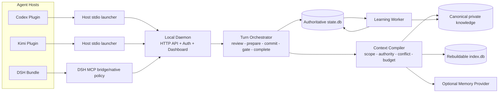

# 系统架构

## 1. 产品边界

Agent Coach 是辅导与可治理记忆控制平面。Codex、Kimi Code 和 DeepSeek Harness 继续负责模型、Agent Loop、权限、工具、会话和用户交互。

平台不读取隐藏思维链。输入只包括显式计划摘要、可观察生命周期事件、结构化学习提案、用户反馈和可验证结果。

Hook 门禁只用于“在支持的工具路径上强制完成辅导握手”，不是安全沙箱。Agent 原有权限与审批仍是安全权威。

## 2. 运行拓扑



Daemon 是唯一业务状态所有者。每个宿主可以启动一个短生命周期 stdio Launcher；Launcher 只转发 MCP JSON-RPC、读取当前用户的本地凭据并自动发现 Daemon，不另建记忆运行时。

Launcher 在 stdin 关闭后退出；Daemon 独立存活。测试必须证明反复连接不会遗留子进程或占用端口。

## 3. 每轮对话的两种审视

| Turn 类型 | 必须行为 |
|---|---|
| 纯问答、无工具 | Prompt/Stop Hook 建立并完成轻量 Trace；可召回稳定偏好，不要求 Ticket |
| 只读勘察 | 允许明确的只读工具；Stop 时完成审视，可提交 LearningProposal |
| 计划产生副作用 | 首个已覆盖副作用工具前必须完成 `coach_prepare` 和 `coach_commit_plan` |

所有 Turn 都可被审视；只有健康 Gateway 下的已覆盖副作用工具执行强握手。

## 4. 门禁与故障语义

| 状态 | 已覆盖副作用工具 | 未覆盖/未知路径 | UI/审计状态 |
|---|---|---|---|
| Gateway healthy，`enforce`，Hook 正常 | 无有效执行状态时拒绝一次并给出恢复步骤 | 未知工具按副作用处理；宿主明确不经过 Hook 的路径无法拦截 | `healthy` 或 `guided` |
| Gateway healthy，`advisory`（首次安装默认） | 记录缺少握手并提示，不拒绝 | 仅记录 capability matrix 能观察到的路径 | `advisory` |
| Gateway 超时/不可达 | 默认 fail-open，不阻塞 Agent 原有工作 | fail-open | 必须记录/显示 `degraded`，不得显示已辅导 |
| Hook 崩溃/宿主未触发 | 宿主自己的 fail-open 语义生效 | 无法声称覆盖 | `unverified`/`degraded` |
| 版本不在验收矩阵 | 不做“已验证”声明 | 允许试用 | `unsupported` 或 `unverified` |

“正常健康模式的辅导门禁”和“故障时不把用户锁死”同时成立。验收必须分别覆盖二者。

## 5. 数据权威闭环

| 数据 | 唯一事实源 | 恢复与生命周期 |
|---|---|---|
| Turn、Guidance、PlanCommit、Ticket、Outcome | `state.db` | SQLite WAL、事务、幂等键、备份/导出 |
| Candidate、反馈、审批提案、审计历史 | `state.db` | 跨重启保留；删除使用内容无关 tombstone |
| 已批准知识 | 用户私有知识目录中的 Markdown + JSON sidecar | 默认非 Git；用户显式选择后可初始化本地/私有 Git |
| 搜索索引 | `index.db` | 可删除；从已批准知识和有效 Candidate 重建 |
| 原始 Prompt/工具输出 | 默认不持久化 | 只有用户显式开启诊断捕获后才按短 TTL 保存 |
| 外部 Provider 数据 | Provider 自身 | 只作为候选/召回增强；忘记流程必须调用 Provider 删除并读回 |
| 集成所有权和备份引用 | `state.db` + App 私有备份目录 | 不进入知识库或源码仓 |

`state.db` 不是“可重建索引”；只有 `index.db` 是。已批准知识从私有知识目录读取，Provider 和索引都不能覆盖它。

并发 Turn 以 `(host_id, session_id, turn_id)` 隔离。所有 HostEvent、LearningProposal 和 MCP mutation 带 `idempotency_key`；重复请求返回原结果，不重复写入。Ticket 的 `execution_epoch` 在同一 Turn 每次 PlanCommit 后递增，旧 Ticket 立即失效。首次 covered gate 原子兑换单次 Ticket 并建立服务端 active epoch；后续动作只查询 epoch，不重放 Ticket。

## 6. 本地安全模型

仅监听 loopback 不足以构成认证。MVP 采用以下组合：

- Daemon 启动时生成随机 bearer secret，保存在用户私有凭据文件；发现文件只包含 origin、PID、instance ID 和 secret 文件引用，不含 secret。
- 凭据文件使用 owner-only 权限；Windows Doctor 检查 ACL，无法确认时显示 degraded。
- 所有 `/api/*` 与 MCP HTTP 内部接口要求 bearer；缺失/错误返回 401。
- Dashboard 通过一次性 bootstrap nonce 换取 `HttpOnly; SameSite=Strict` 会话 Cookie，随后从无 token URL 运行。
- mutation 要求同源 Origin、Host 白名单和 CSRF token；CORS 默认不发送允许头。
- 固定 CSP，禁止任意外部脚本；所有记忆正文按文本渲染，不使用不可信 HTML。
- CLI 支持 secret 轮换；旧 secret 立即失效。

这不能防御已经以同一 OS 用户权限运行的恶意进程，但能防止普通恶意网页和未认证 localhost 请求。该限制必须在安全文档中公开。

## 7. 检索与上下文

检索顺序固定为：

```text
scope/status/expiry/sensitivity/relation hard filters
  → lexical + optional semantic candidates
  → conflict isolation
  → authority ordering
  → plan-aware reranking
  → max 8 items / max 1200 estimated tokens
  → GuidancePacket
```

相关度不能提升权威。历史内容进入“证据”区；只有当前已批准的 canonical policy 可以进入“约束”区。空命中仍返回有效 GuidancePacket，Agent 可以提交未改变的 RevisedPlan。

平台输出统一携带 `origin=agent-coach` 和 packet ID。Capture 识别这些标记并拒绝再次沉淀，避免反馈环。

## 8. Keyless 学习路径

无 LLM/API Key 时，Agent 或 Host 在 `coach_complete` 中提交结构化 `LearningProposal[]`。Core 只做 Schema 校验、作用域检查、确定性去重、敏感字段拒绝和 Candidate 入队。

外部 Memory Provider 只增强自动提取、语义召回与归纳；未启用或故障时不影响完整 keyless 生命周期。

## 9. 数据生命周期和演进

知识状态：

```text
candidate → approved → superseded / obsolete
         ↘ rejected
```

审批采用 preview/apply：Preview 返回 exact proposal hash；Apply 必须携带同一 hash，基础 Revision 改变时拒绝。Skill、角色和策略只能生成 inactive proposal；不在 MVP 自动发布。

暂停学习后仍允许只读召回，但不写新的 Journal、Candidate 或 Provider 数据。忘记、导出、重置和 Provider 出站见 [DATA-LIFECYCLE.md](DATA-LIFECYCLE.md)。

## 10. 未来插件边界

MVP 不实现市场，但保留彼此隔离的扩展种类：`host-adapter`、`memory-provider`、`knowledge-connector`、`retriever`、`evaluator`、`capability-exporter`。每类必须声明协议版本、配置 Schema、网络/文件权限、可读数据域和副作用；不提供一个拥有全部权限的通用插件入口。
